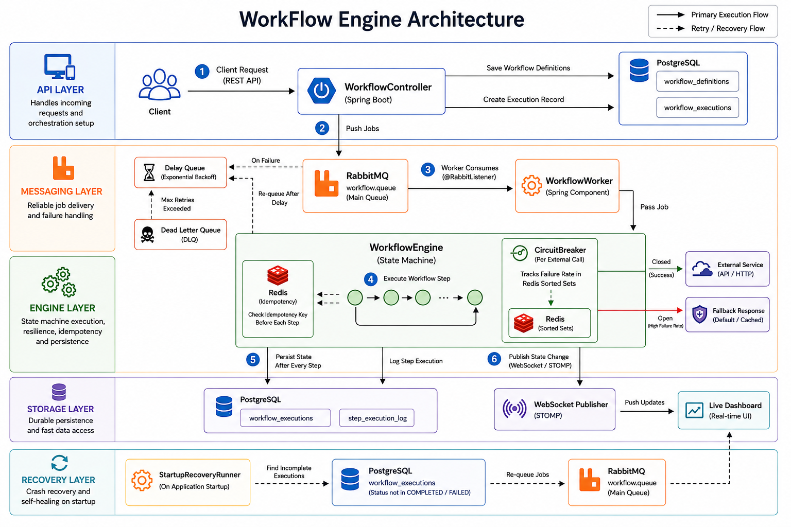

# ⚙️ WorkFlow Engine

> A fault-tolerant, self-healing workflow orchestration engine built in Java Spring Boot.  
> Executes multi-step jobs reliably, recovers from crashes automatically, retries failures intelligently, and streams live execution state to a real-time dashboard.

[](https://openjdk.org/)
[](https://spring.io/projects/spring-boot)
[](https://www.postgresql.org/)
[](https://www.rabbitmq.com/)
[](https://redis.io/)
[](https://www.docker.com/)

---

## The Problem

When a distributed system executes a multi-step process and something goes wrong midway — a service is down, the server crashes, a network call times out — most naive implementations either restart the entire job from scratch or silently drop it.

Neither is acceptable in production.

This engine solves that problem. It is the same kind of infrastructure that powers order processing pipelines at companies like Swiggy or transaction workflows at Razorpay — built from scratch to demonstrate deep understanding of fault tolerance, stateful execution, and distributed systems reliability.

---

## Architecture



---

## Core Features

### Stateful Crash Recovery
Every step transition is persisted to PostgreSQL before the next step begins. If the server crashes mid-execution, `StartupRecoveryRunner` detects incomplete executions on boot and re-queues them. Jobs resume from the last recorded step; the system is designed to minimize reprocessing and resume reliably.

### Exponential Backoff Retry
Failed steps are not retried immediately. The job is pushed to a delay queue with an increasing wait — 2s, 4s, 8s. After the configured retry limit is exhausted, the job moves to a Dead Letter Queue and the execution is marked `FAILED`.

### Redis Idempotency Guarantees
Before executing any step, the engine checks for an existing idempotency key in Redis. If the same step is picked up twice — due to a crash or duplicate message — the engine detects it and skips re-execution. Every step execution is idempotency-protected to minimize duplicate execution. This reduces the likelihood of double charges or duplicate emails while acknowledging that duplicate delivery can still occur in distributed environments; the system is designed to make duplicate effects unlikely and detectable.

### Custom Circuit Breaker
Every external service call is wrapped in a hand-built circuit breaker — not Resilience4j. It tracks failure rate within a **sliding time window** using Redis Sorted Sets (`ZADD` / `ZREMRANGEBYSCORE` / `ZCOUNT`). When failures cross a threshold, the circuit opens and all calls are blocked. After a cooldown, it moves to half-open and sends one test request. Success closes it. Failure resets the cooldown.

| State | Behavior |
|-------|----------|
| `CLOSED` | Normal operation — all requests pass through |
| `OPEN` | All requests blocked — fallback served immediately |
| `HALF_OPEN` | One test request allowed — determines next state |

Three configurable fallback strategies per service:
- **CACHED** — returns last known good response from Redis
- **DEFAULT** — returns a static safe response
- **DEGRADED** — returns partial data with a warning flag

### Real-Time WebSocket Dashboard
Every state change pushes a WebSocket event via STOMP over SockJS. The frontend dashboard displays live execution status — current step, state, timestamps — color coded by status. No polling. No refresh.

### Observability
- Structured step execution logs with timestamps, duration, attempt count, and error messages
- Metrics endpoint exposing success rate, failure rate, and average duration per workflow type
- Scheduled stuck workflow detector — flags executions that have been `RUNNING` beyond a configurable threshold

---

## Workflow Execution States

```
PENDING → RUNNING → COMPLETED
                ↓
         WAITING_RETRY → RUNNING (on retry)
                ↓
             FAILED (max retries → Dead Letter Queue)
```

---

## Tech Stack

| Layer | Technology |
|-------|-----------|
| Backend | Spring Boot 3.x, Java 17 |
| Database | PostgreSQL + Spring Data JPA |
| Message Queue | RabbitMQ + Spring AMQP |
| Cache / Idempotency | Redis (Sorted Sets + Strings) |
| Real-Time | WebSocket with STOMP over SockJS |
| Security | Spring Security + JWT |
| Testing | JUnit 5 + Mockito |
| Containerization | Docker Compose |

---

## API Reference

```
POST   /api/auth/login                  →  get JWT token
POST   /api/workflows/define            →  define a new workflow
POST   /api/workflows/{id}/trigger      →  trigger an execution
GET    /api/workflows/{id}/status       →  get current execution status
GET    /api/workflows/{id}/history      →  get full step execution log
GET    /api/circuit-breakers/status     →  get state of all circuit breakers
POST   /api/circuit-breakers/reset/{id} →  manually reset a circuit breaker
GET    /api/metrics                     →  success rate, failure rate, avg duration
WS     /ws/dashboard                    →  WebSocket for live updates
```

### Roles
| Role | Permissions |
|------|------------|
| `ADMIN` | Define workflows, trigger executions, reset circuit breakers, view all metrics |
| `VIEWER` | View dashboard, execution status, and circuit breaker states |

---

## Redis Key Schema

| Key Pattern | Structure | Purpose |
|-------------|-----------|---------|
| `step:{jobId}:{stepName}` | String | Idempotency check before step execution |
| `circuit:{serviceId}:state` | String | Current circuit breaker state |
| `requests:{serviceId}` | Sorted Set | Sliding window — all requests |
| `failures:{serviceId}` | Sorted Set | Sliding window — failed requests only |
| `pressure:{serviceId}` | String | Failure pressure counter |
| `cache:{serviceId}:lastResponse` | String | Cached fallback response |

---

## Getting Started

### Prerequisites
- Java 17+
- Maven
- Docker + Docker Compose

### 1. Clone the repository
```bash
git clone https://github.com/namansureka/workflow-engine.git
cd workflow-engine
```

### 2. Set up environment variables
```bash
cp .env.example .env
# Edit .env and set your POSTGRES_PASSWORD and JWT_SECRET
```

### 3. Start infrastructure
```bash
docker-compose up -d
```
This starts PostgreSQL, RabbitMQ, and Redis. Spring Boot auto-creates all tables on first run.

### 4. Run the application
```bash
mvn spring-boot:run
```

### 5. Access services
| Service | URL |
|---------|-----|
| API | http://localhost:8080 |
| Live Dashboard | http://localhost:8080/dashboard |
| RabbitMQ Management | http://localhost:15672 (guest/guest) |

---

## Example Usage

### Define a workflow
```bash
curl -X POST http://localhost:8080/api/workflows/define \
  -H "Authorization: Bearer <token>" \
  -H "Content-Type: application/json" \
  -d '{
    "name": "order-processing",
    "steps": [
      { "stepName": "chargePayment", "retryLimit": 3, "timeoutMs": 5000 },
      { "stepName": "updateInventory", "retryLimit": 2, "timeoutMs": 3000 },
      { "stepName": "sendEmail", "retryLimit": 1, "timeoutMs": 2000 }
    ]
  }'
```

### Trigger an execution
```bash
curl -X POST http://localhost:8080/api/workflows/order-processing/trigger \
  -H "Authorization: Bearer <token>"
```

### Check status
```bash
curl http://localhost:8080/api/workflows/1/status \
  -H "Authorization: Bearer <token>"
```

---

### Realistic workflow example — order-processing
This example uses the three-step workflow defined above: `chargePayment` → `updateInventory` → `sendEmail`.

- If `chargePayment` fails (for example, due to a timeout or insufficient funds) the step marks the attempt as a failure. The engine records the failure, increments the retry counter and schedules a retry on the configured delay queue according to the retry policy.
- When the retry delay expires the execution is re-queued and the worker resumes processing. The engine reads the persisted current step and attempts `chargePayment` again; if the retry succeeds, processing continues with `updateInventory` and `sendEmail`.
- If the host crashes after `chargePayment` succeeds but before `updateInventory` runs, `StartupRecoveryRunner` will pick up the execution on restart and resume from `updateInventory`. The persisted current-step and idempotency keys help prevent re-applying the payment.

This illustrates operational behavior: transient failures are retried, progress is persisted to avoid reprocessing, and recovery resumes from the last known good state.


---
## Project Structure

```
com.naman.workflow_engine
├── job/          → workflow definitions, execution state, trigger API
├── worker/       → RabbitMQ consumers, step executors, retry logic, idempotency
├── circuit/      → circuit breaker state machine, sliding window failure tracker
├── dashboard/    → WebSocket handlers, live status push
├── recovery/     → startup crash recovery
├── observability/→ structured logging, metrics, stuck workflow detection
├── security/     → JWT authentication, role-based access
└── common/       → exceptions, DTOs
```

---

## Author

**Naman Sureka**  
[](https://github.com/namansureka)
